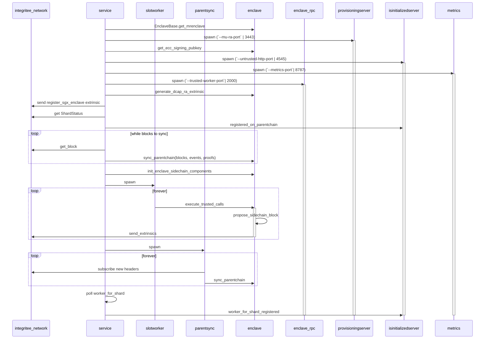
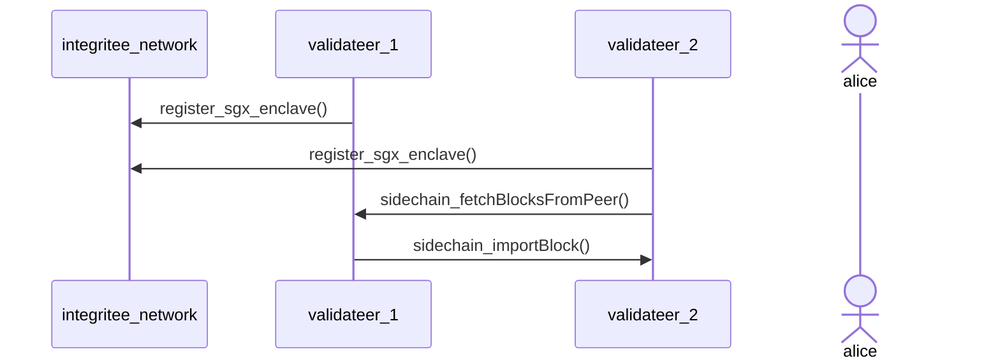

# sidechain startup internal view 

```mermaid
sequenceDiagram
    participant integritee_network
    participant service
    participant slotworker
    participant parentsync
    participant enclave
    participant enclave_rpc
    participant provisioningserver
    participant isinitializedserver
    participant metrics
    service ->> enclave: EnclaveBase.get_mrenclave
    service ->> provisioningserver: spawn (`--mu-ra-port` | 3443)
    activate provisioningserver
    service ->> enclave: get_ecc_signing_pubkey
    service ->> isinitializedserver: spawn (`--untrusted-http-port | 4545)    
    activate isinitializedserver
    service ->> metrics: spawn (`--metrics-port`| 8787)
    activate metrics
    service ->> enclave_rpc: spawn (`--trusted-worker-port`| 2000)
    activate enclave_rpc
    
    service ->> enclave: generate_dcap_ra_extrinsic
    service ->> integritee_network: send register_sgx_enclave extrinsic
    service ->> integritee_network: get ShardStatus
    service ->> isinitializedserver: registered_on_parentchain
# schedule teeracle re-registration and updates
    loop while blocks to sync
        service ->> integritee_network: get_block
        service ->> enclave: sync_parentchain(blocks, events, proofs)
    end
    service ->> enclave: init_enclave_sidechain_components
    service ->> slotworker: spawn
    loop forever
        slotworker ->> enclave: execute_trusted_calls
        activate enclave
        enclave ->> enclave: propose_sidechain_block
        enclave ->> integritee_network: send_extrinsics
        deactivate enclave
    end
    service ->> parentsync: spawn
    loop forever
        parentsync ->> integritee_network: subscribe new headers
        parentsync ->> enclave: sync_parentchain
    end
    service ->> service: poll worker_for_shard
    service ->> isinitializedserver: worker_for_shard_registered
    
    deactivate enclave_rpc
    deactivate metrics
    deactivate isinitializedserver
    deactivate provisioningserver
```

# sidechain lifetime external view

```mermaid
sequenceDiagram
    participant integritee_network
    participant validateer_1
    participant validateer_2
    actor alice
    
    validateer_1 ->> integritee_network: register_sgx_enclave()

    validateer_2 ->> integritee_network: register_sgx_enclave()
    
    validateer_2 ->> validateer_1: sidechain_fetchBlocksFromPeer()

    validateer_1 ->> validateer_2: sidechain_importBlock()
```
