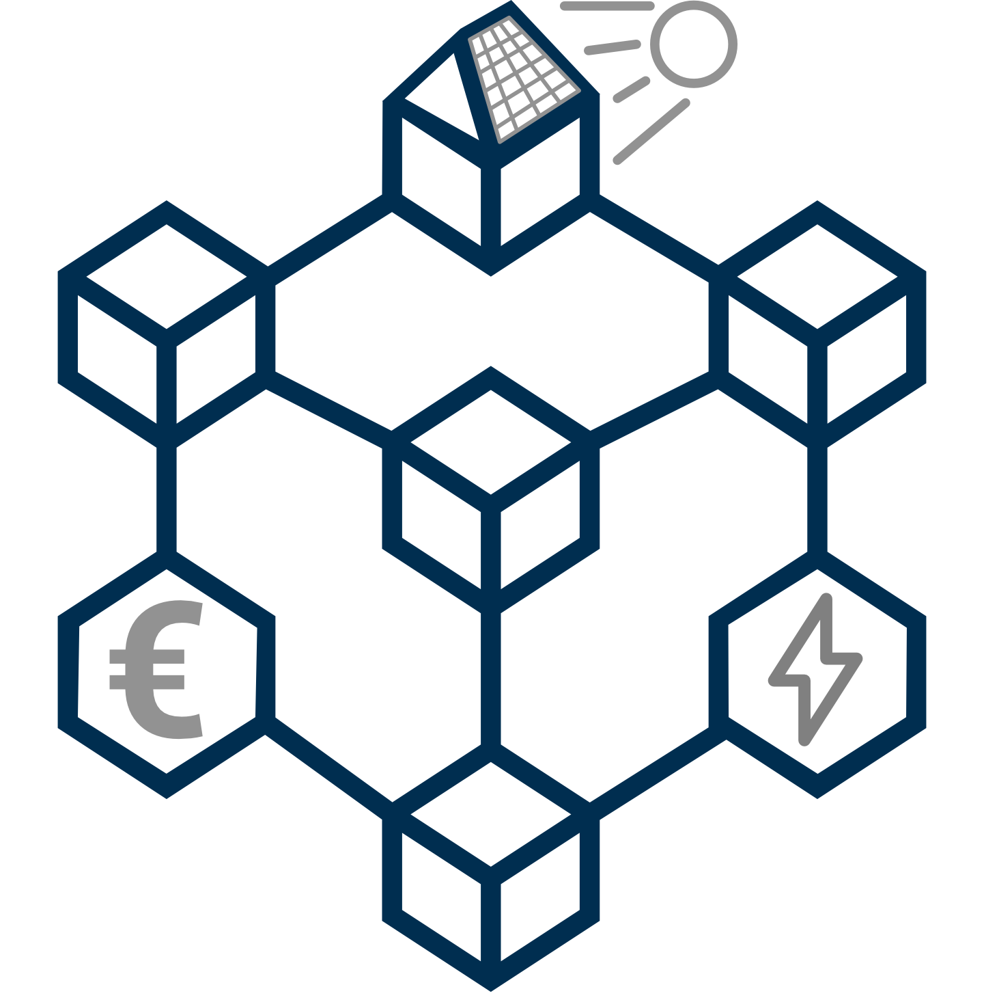

<div align="center">
   <p>
      <a href="#" >
      
      </a>
   <p/>
   <h1 style="border-bottom: none">
      BEST Hybrid Blockchain Platform
   </h1>
   <p>Hybrid blockchain-based energy market verification platform
   <p/>
</div>

## 👋 Introducing `BESTEnergy Hybrid Blockchain Platform`

Implements trusted execution environment (TEE) for matching bids and offers, creating Merkle root of bids/offers and results, and store the root hash in the Integritee network

## 📗 API Documentation

Read the API documentation [here](docs/API.md).

## 🔥 Features

-   🔍 Create hashes for market orders
-   🤝 Match orders in the TEE
-   🌳 Create Merkle tree
-   💾 Store and retrieve Merkle root hash on the blockchain

## 🛠️ Development Setup for Docker

These instructions will get you a copy of the project up and running inside a Docker container for development and testing purposes.

### 📌 Prerequisites

Before you start, make sure you have completed the following prerequisites:

-   📥 Download the `integritee-dev` Docker image from [here](https://hub.docker.com/r/integritee/integritee-dev).
-   🔗 Clone the `integritee-node` repository from [here](https://github.com/integritee-network/integritee-node).
-   🔗 Clone the `BEST-Energy` repository from [here](https://github.com/olisystems/BEST-Energy).

📝 **Note**: Both of these repositories must be in the same directory.

### 🏗️ Develop Inside a Docker Container

Follow the steps below to have the development environment running:

1. Mount the current directory containing the integritee-worker and integritee node into the Docker container and start a bash session inside:

```
$ docker run -it --mount "type=bind,src=$(pwd),dst=/opt/shared" --workdir /opt/shared -p 9944:9944 -p 2000:2000 -p 3443:3443 integritee/integritee-dev:0.1.12 /bin/bash
```

2. Build the `integritee-node`

Inside the shell in the Docker container:

```
$ cd integritee-node
$ cargo build release --features "skip-extrinsic-filtering skip-ias-check"
```

3. Build the `worker` node

```
$ cd ../
$ cd BEST-Energy
$ SGX_MODE=SW WORKER_MODE=offchain-worker make
```

4. Run the `integritee-node`

Execute the following command inside the `integritee-node` directory:

```
$ ./target/release/integritee-node --tmp --dev -lruntime=info --ws-port 9944 --port 30390 --rpc-port 9933 --ws-external --rpc-external
```

5. Run the `worker`

Execute the following command inside the `BEST-Energy/bin` directory:

```
$ RUST_LOG=warn,ws=warn,sp_io=error,substrate_api_client=warn,json_rpsee_ws_client=warn,jsonrpsee_ws_server=warn,enclave_runtime=warn,ingegritee_service=warn,ita_stf=debug ./integritee-service --clean-reset run --skip-ra --dev
```

## 🍔 Built With

-   [integritee-node](https://github.com/integritee-network/integritee-node) – A substrate-based node that maintains a registry of remote attested integritee-service enclaves. The node also acts as a proxy for encrypted requests which are forwarded to the integritee-service.

-   [worker](https://github.com/miguelmota/merkletreejs) – Integritee worker for Integritee node or parachain.

-   [binary-merkle-tree](https://docs.rs/binary-merkle-tree/5.0.0/binary_merkle_tree/) – A crate for implementing binary Merkle Tree utilities necessary for Ethereum bridge & Solidity contract inter-operation.

## 🛡️ License

## 🤝 Contributing

Pull requests are welcome.

1. Fork the repository.
2. Create your new feature branch: `git checkout -b new-feature-branch`
3. Stage your changes: `git add .`
4. Commit the changes: `git commit -m "add commit message"`
5. `push` to the branch: `git push origin new-feature-branch`
6. Submit a `pull request`.
