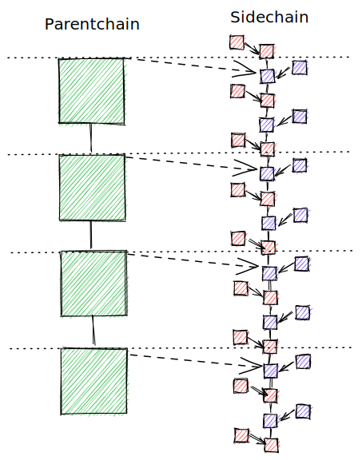
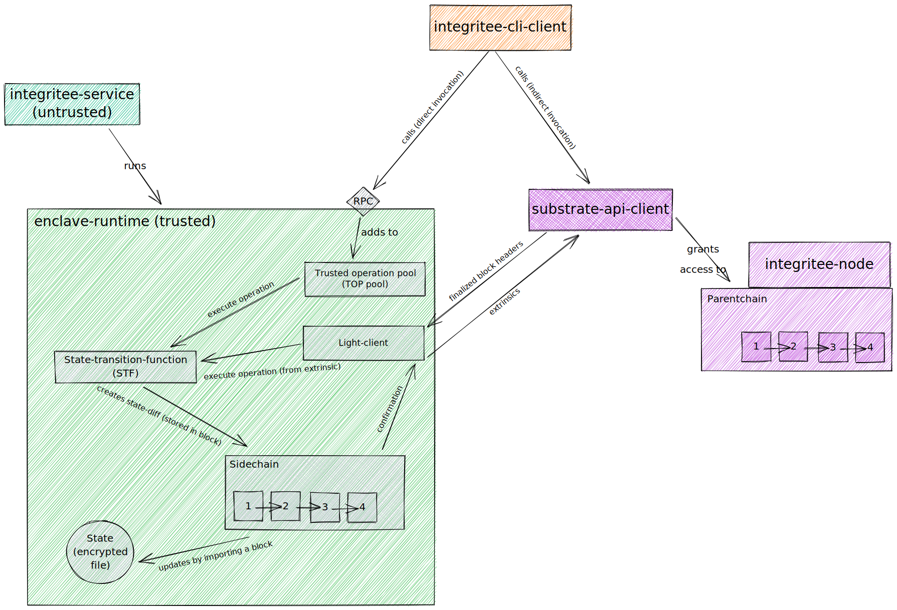

# Knowhow Dump

---

📝 
This folder contains documents and links with (potentially outdated) information about the worker.
Use with caution, as this is work in progress. Hence, the code is most likely progressing faster than this documentation.

---

## Content
- The [Introduction](#introduction) explains some basic concepts to work with a worker.
- [Mode of Operation](#mode-of-operation) describes the components of the worker and what they are responsible for. 
- In the section [How To Use](#how-to-use) we describe how you can run the code.
- [Useful Links](#useful-links) contains links for further reading.

## Introduction
The goal of the Integritee worker is to execute calls in a trusted environment, called *enclave*.

### Enclaves
An Intel SGX enclave is a private region of memory and the promise that neither the code nor the memory can be read or saved by any process outside the enclave. The CPU itself allocates the memory and protects it by encryption. The content in the memory is decrypted only within the CPU itself such that neither the operating system nor any high privilege processes can spy the executed code or its data. 

An enclave call (ECALL) is a call to a pre-defined function within the enclave. An ECALL can contain parameters and pointers to shared memory. The enclave can call functions of the application by outside calls (OCALLs) which cannot contain pointers to memory inside the enclave.

The Intel Attestation Service (IAS) can verify that your enclave is indeed a trustworthy enclave. However, you have to be registered to use this service. 

### Parentchain Registration
On startup a worker registers onto a parentchain or [Integritee Node](https://github.com/integritee-network/integritee-node). In this important step the [Teerex Pallet](https://github.com/integritee-network/pallets) comes into use. It is responsible for the remote attestation for a newly registered worker. In this step we ensure that the enclave of the worker is approved by Intel. From this point on we can trust that any registered worker is built from a codebase that we can rely on. This way not every user of the worker has to register with the IAS.

Once a worker is registered, it syncs the blocks from the parentchain. There are two different ways.
- A *full client* syncs the whole blocks. All information in the parentchain are imported.
- A *light client* in contrary syncs only the header of the parentchain blocks. Via Merkle tree proof the header can be validated without investigation the entire block data.

### Block production
After the registration of the worker to the parentchain, it starts to produce blocks for another chain: the sidechain.
Block production in a classic blockchain is prone to block authors that store faulty data into proposed blocks and hence requires an appropriate consensus mechanism. The dependability of such faulty block authors is called Byzantine Fault Tolerance (BFT).
In our setup all workers can trust each other. Hence, there is no need to BFT when workers produce blocks for the sidechain. The consensus algorithm used to determine which worker produces the next block is called Aura. It is much simpler than in many other chains, since it is just round-robin.

### Forks And Finalization
Let's say a small group of workers shares the same network, which is disconnected to the outside world for a while. The workers within the group can still communication with each other. They would continue to produce blocks. As soon as this group can communicate with the rest of the workers again, all workers have to find consensus which of the two states is correct. This is called finalization.  

## Mode Of Operation
To call a function in the enclave the worker offers two options for you
1. ***Indirect Invocation***: A call is submitted to the parentchain. In the worker the light client takes the call when syncing the parentchain blocks. The call is executed in the enclave. Eventually, the call confirmation is signed and written again to the parentchain.
2. ***Direct Invocation***: The call is submitted to the worker via a TLS protected RPC connection. The call is executed in the enclave and the signed call confirmation is returned to the client. Since the block production time in the sidechain is much smaller, direct invocation is more performant than indirect invocation.

### Three Keys
To ensure that all data is protected there are three keys
1. The *state encryption key* is used to encrypt and decrypt the state storage. It is common to all enclaves.
2. The *shielding key* is used to encrypt the call before submitting and to decrypt it in the enclave. It is common to all enclaves. The public shielding key is signed with the signing key. 
3. The *signing key* is used to sign transactions. It is unique for every enclave.

### Transaction pool
The transaction pool (tx-pool or also top-pool) is the pool where all transactions (tx) or extrinsics (xt) are stored before they are executed, whether they originate from direct or indirect invocation.

### State and State-diff
The blocks of a blockchain contain state-diffs. A state-diff can for example be 
> Balance of Alice: 3

The state-diff does not contain information that does not change, like the balance of Bob. In order obtain the complete state you have to apply all state-diffs. The worker stores the state in an encrypted file as a hashmap. (However even if you can decrypt the file, you would not get useful data, because that's what Alain said. Only the runtime can interpret it.)

Why do we store the state? The enclave needs the state to create a state-diff from a call. Let's say the enclave gets a call that says
> Transfer 7 to Alice

To create the correct state-diff, the enclave has to query the state to check Alice's current balance and add 7 to it. The resulting state-diff is therefore
> Balance of Alice: 10

### Execution of a Trusted Call
Before our worker can execute a trusted call it has to determine that it is assigned to create the upcoming slot by the consensus algorithm aura. Since aura is simply round-robin it is clear beforehand when the next slot for our worker's block will start. After our slot started we can go on with the actual execution:

1. The worker will invoke an ECALL to the enclave. In the enclave the call is decrypted and executed by the CPU. Therefore, the enclave has to query the state. It returns a *state diff*.
2. The state diff is written to a newly created sidechain block.
3. Our worker broadcasts (in early times: gossip) the block to all registered workers including itself via RPC.
4. In another thread our worker (like all other workers) receives the block it just broadcast to the workers. It validates the block and checks whether it originates from the correct worker that was commissioned to create the corresponding block.
5. Only now the state-diff is applied to the state and the block is appended to the blockchain. 

### Shards
For scalability reasons the state is subdivided into one or many *shards*. Each shard only stores a part of the information in the network. Every shard has one sidechain and a number of dedicated workers working on the sidechain. However, a worker can be part of several shard, i.e. it can be engaged in several sidechains.

---

TODO: State Transition Function, RUNTIME (implementation of the state machine)

## How to use

### Run a node
To get an environment with a worker running, the first step is to start the [Integritee Node](https://github.com/integritee-network/integritee-node). You can find an elaborate documentation in the [Integritee Book](https://book.integritee.network/howto_node.html). After building the node by

    cargo build --release 

you can start the node by 

    target/release/integritee-node    

If you are developing on a non-SGX environment, you might want to disable the remote attestation process. In this case you need to add the features skip-ias-check when building the node:

    cargo build --release --features skip-ias-check

### Run the worker
This project is build by running

    make

in the root project folder. If you are not working on an SGX environment you want to set the environment variable `SGX_MODE` to `SW`:

    SGX_MODE=SW make

This the binaries ` integritee-service` and `integritee-cli` in the `bin/` folder. TODO
In the current version the worker relies on files in the current working directory. Therefore, to set up your system, run the next commands in the `bin/` directory. 

    touch spid.txt key.txt
    ./integritee-service init-shard
    ./integritee-service shielding-key
    ./integritee-service signing-key
    ./integritee-service mrenclave > ~/mrenclave.b58

- `spid.txt` and `key.txt` are only required, if you use. Otherwise, empty text files suffice.
- `./integritee-service init-shard` creates a default shard inside the directory `shards`. 
- Shielding keys are common to all workers. `./integritee-service shielding-key` generates the file `enclave-shielding-pubkey.json` containing a newly generated public shielding key. If the worker you are about to start is not the first worker, it has to request the shielding key from a worker that is already registered by `./integritee-service request-keys <addr>`, where `<addr>` is the address of a running worker. This process requires mutual remote attestation (mu-ra) between the workers
- The signing key is individual for each worker. `./integritee-service signing-key` generates the file `enclave-signing-pubkey.bin` with a new signing key.
- Eventually, `./integritee-service mrenclave > ~/mrenclave.b58` stores the MRENCLAVE. The MRENCLAVE is a unique identifier for the enclave, basically the hash of the enclave binary.
The command to start the worker for those with an SGX machine is

    ./integritee-service run 

and for those without an SGX machine

    ./integritee-service run --skip-ra

## Useful Links
### O- / ECALLs
- OCALL Bridge: https://github.com/integritee-network/worker/pull/293 & https://github.com/integritee-network/worker/pull/299
- Enclave ECALLs / OCALLs: https://github.com/integritee-network/worker/issues/279
- Abstract ECALLs in enclave: https://github.com/integritee-network/worker/issues/286
- Abstract OCALLs in enclave: https://github.com/integritee-network/worker/issues/279

### Sidechain
- Sidechain functionality: https://polkadot.polkassembly.io/post/111
- Sidechain flow: https://github.com/integritee-network/worker/issues/567
- Peer sync and block production suspension for sidechain: https://github.com/integritee-network/worker/pull/618
- Simplified sidechain sequence, of a user call and the STF: https://raw.githubusercontent.com/haerdib/substraTEE_diagramms/main/sidechain-sequence.svg
- Top_pool sequence: https://raw.githubusercontent.com/haerdib/substraTEE_diagramms/main/submit_and_watch_sequence.svg
### Parentchain
- A rough overview of the architecture surrounding the parentchain block import dispatching: https://github.com/integritee-network/worker/pull/530

### Runtime
- Enclave runtime: https://github.com/integritee-network/worker/pull/472

### Non-worker related graphics
- substrate related graphics: https://github.com/brenzi/substrate-doc
