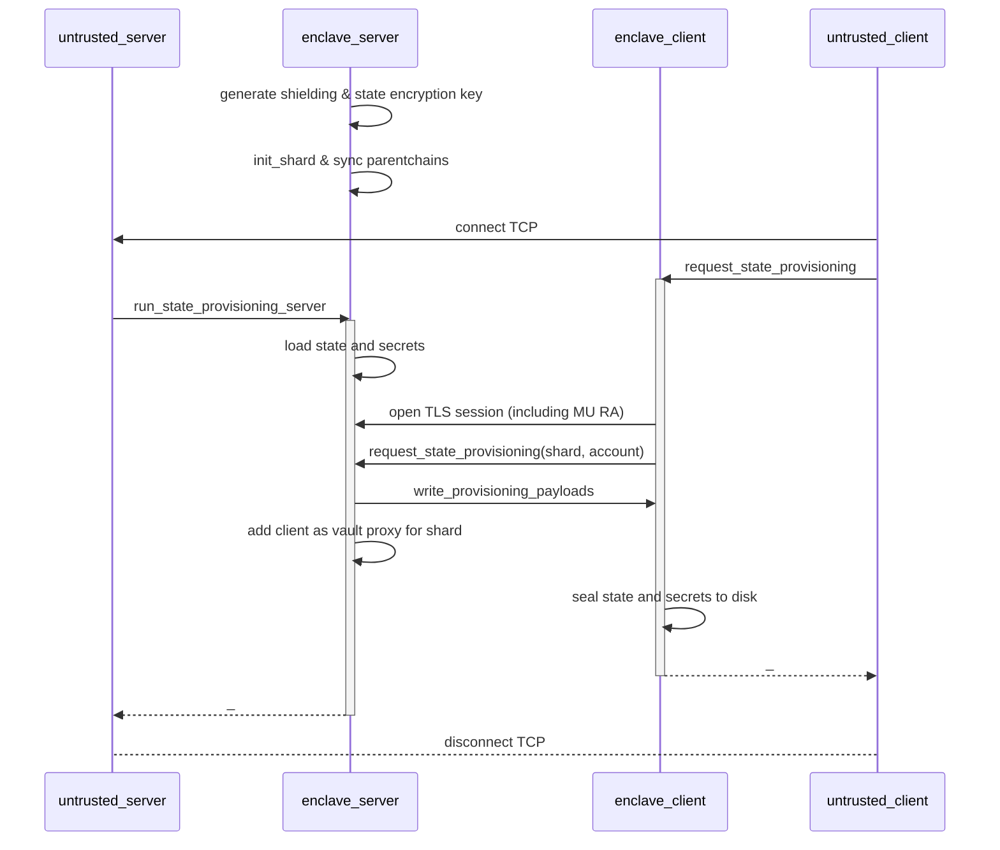

# provisioning 

each worker runs a provisioning server for other workers of the same MRENCLAVE and shard to get recent stf state and secrets from.

Light client storage can also be provisioned to avoid re-synching the entire parentchains with each worker

enclave instances are short-lived on both sides, just for a single request.

